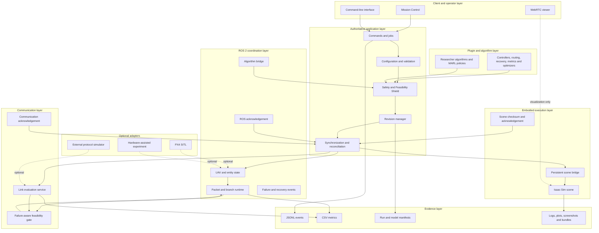
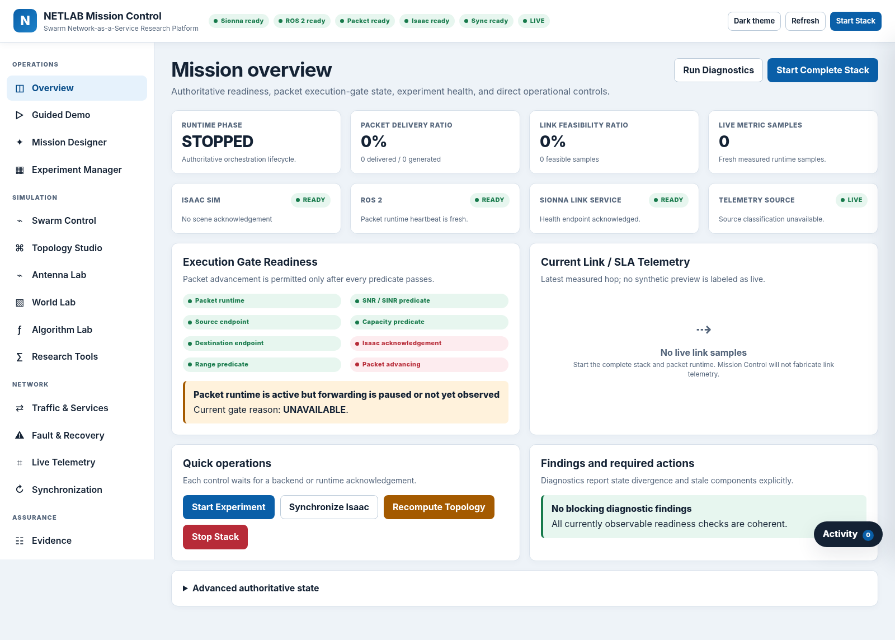
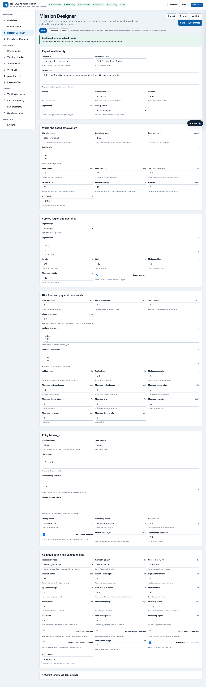
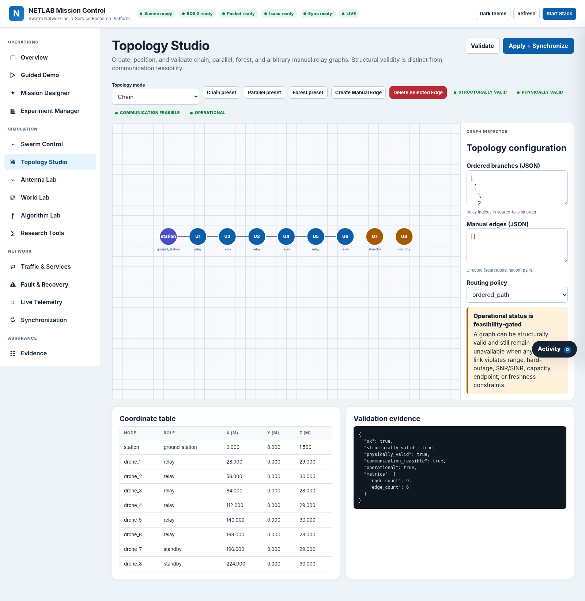
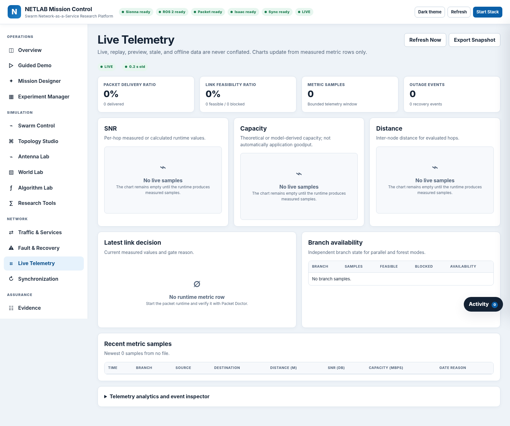
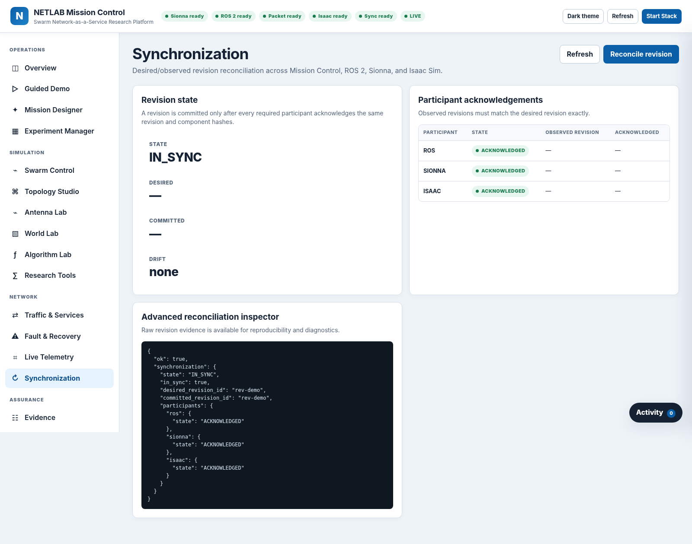
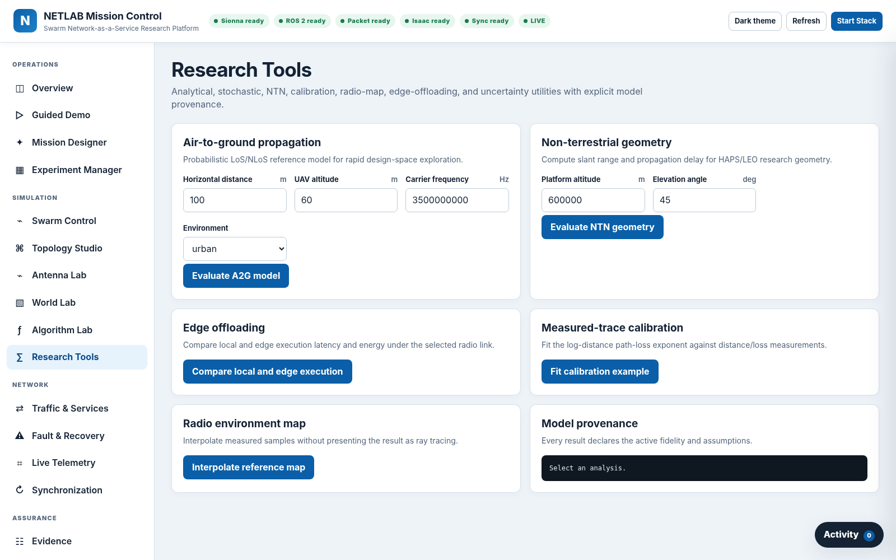
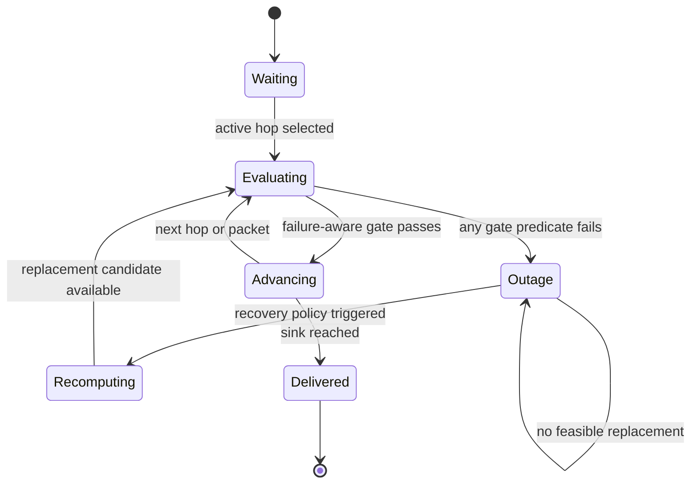

# High-Fidelity Swarm Network-as-a-Service Simulator

[](VERSION)
[](pyproject.toml)
[](Docker/workspace/ros2)
[](Docker/docker/isaacsim)
[](LICENSE)

A modular research simulator for studying **UAV swarms as reconfigurable airborne communication infrastructure**. The framework couples embodied UAV execution, ROS 2 coordination, telecom-aware link evaluation, failure-aware relay operation, runtime reconfiguration, researcher-defined algorithms, scientific telemetry, and reproducible evidence collection in one executable workflow.

> [!IMPORTANT]
> **Naming clarification.** The simulator currently has no formal product name. **NETLAB is the name of the laboratory, not the name of the software.** This document therefore refers to the software as *the simulator*. Some repository paths, package identifiers, environment variables, ROS entities, and command filenames retain legacy laboratory-specific identifiers for compatibility; these internal identifiers should not be interpreted as product branding.

> [!NOTE]
> This is a research platform, not a certified flight, safety, telecommunications-compliance, or operational network-management system. Fidelity depends on the selected models, adapters, configuration, and execution environment.

---

## Table of contents

- [Research objective](#research-objective)
- [Central contribution](#central-contribution)
- [System model](#system-model)
- [Key capabilities](#key-capabilities)
- [Architecture](#architecture)
- [Runtime components](#runtime-components)
- [Mission Control](#mission-control)
- [Relay topology modes](#relay-topology-modes)
- [Communication-feasibility gate](#communication-feasibility-gate)
- [Failure and recovery semantics](#failure-and-recovery-semantics)
- [Transactional synchronization](#transactional-synchronization)
- [Fidelity profiles](#fidelity-profiles)
- [Researcher algorithms and plugins](#researcher-algorithms-and-plugins)
- [Safety and Feasibility Shield](#safety-and-feasibility-shield)
- [Experiment configuration](#experiment-configuration)
- [Scenario library](#scenario-library)
- [Metrics and telemetry](#metrics-and-telemetry)
- [Evidence and reproducibility](#evidence-and-reproducibility)
- [Repository structure](#repository-structure)
- [Requirements](#requirements)
- [Installation](#installation)
- [Quick start](#quick-start)
- [Operating workflow](#operating-workflow)
- [Command-line reference](#command-line-reference)
- [ROS 2 interfaces](#ros-2-interfaces)
- [HTTP API](#http-api)
- [Testing and validation](#testing-and-validation)
- [Troubleshooting](#troubleshooting)
- [Known limitations](#known-limitations)
- [Security and responsible use](#security-and-responsible-use)
- [Contributing](#contributing)
- [License](#license)

---

## Research objective

UAV-assisted networks and non-terrestrial networks require more than independent mobility and channel simulation. A credible experiment must represent the closed loop among:

1. UAV motion and embodied state;
2. relay topology and branch-level traffic state;
3. radio/link feasibility;
4. runtime failures and outages;
5. topology recomputation and standby promotion;
6. operator commands and algorithm outputs;
7. synchronization across simulation components; and
8. structured evidence for repeatable analysis.

The simulator addresses the gap between robotics simulators and wireless/network simulators:

- robotics simulators commonly reproduce motion and scene interaction but do not treat communication-service state as a first-class runtime variable;
- wireless simulators commonly reproduce propagation, traffic, and protocol behavior but omit embodied multi-UAV execution;
- this framework couples both domains through a common authoritative state and explicit runtime acknowledgements.

The intended use cases include degraded urban infrastructure, post-disaster connectivity restoration, infrastructure-sparse remote regions, dense temporary events, emergency response, aerial relay chains, mobile ground users, remote sensing missions, and NTN-assisted connectivity.

---

## Central contribution

The defining invariant is:

> **Communication feasibility is an execution gate, not a post-processing metric.**

A packet, branch, or relay stream advances only when the active hop satisfies the configured constraints. At minimum, the runtime verifies:

- source and destination endpoints exist;
- both endpoints are active;
- neither endpoint is failed;
- the route and branch state are valid;
- the link metric is fresh;
- operational-range and hard-outage-distance limits are satisfied;
- SNR or SINR meets the configured threshold;
- link capacity meets the configured service threshold;
- antenna and world/model state are valid; and
- the communication service is available.

When any predicate fails, forwarding pauses, the authoritative packet cursor does not advance, and the outage reason is recorded. Recovery is not considered successful merely because a new line or path appears in the visual scene. The replacement path must pass the same failure-aware feasibility gate and must be acknowledged by the runtime participants.

This behavior distinguishes the simulator from:

- a static visualization or animation;
- a generic UAV simulator;
- a wireless link-budget calculator;
- a channel-model post-processing tool; and
- a control dashboard that assumes a configuration change has been applied because a file was saved.

---

## System model

The swarm communication infrastructure is represented as a time-varying relay graph

\[
G(t) = \bigl(V(t), E(t)\bigr),
\]

where \(V(t)\) contains the ground station, active relay UAVs, standby UAVs, users, and other configured entities, while \(E(t)\) contains candidate or active communication links.

Let

\[
F(t) \subseteq V(t)
\]

be the set of failed UAVs and

\[
V_a(t) = V(t) \setminus F(t)
\]

be the active failure-free node set. For nodes \(i\) and \(j\), the Euclidean distance is

\[
d_{ij}(t)=\left\|\mathbf{p}_i(t)-\mathbf{p}_j(t)\right\|_2.
\]

A nominal feasibility gate can be written as

\[
\chi_{ij}(t)=
\mathbf{1}\!\left[d_{ij}(t)\le R_{\mathrm{op}}\right]
\mathbf{1}\!\left[d_{ij}(t)<R_{\mathrm{hard}}\right]
\mathbf{1}\!\left[\gamma_{ij}(t)\ge \gamma_{\min}\right]
\mathbf{1}\!\left[C_{ij}(t)\ge C_{\min}\right]
\mathbf{1}\!\left[m_{ij}(t)\ \text{is fresh}\right],
\]

where \(R_{\mathrm{op}}\) is the operational range, \(R_{\mathrm{hard}}\) is the hard-outage distance, \(\gamma_{ij}\) denotes SNR or SINR, \(C_{ij}\) is capacity, and \(m_{ij}\) is the metric record.

Failure-aware feasibility is

\[
\chi^{F}_{ij}(t)=
\chi_{ij}(t)
\mathbf{1}\!\left[i\in V_a(t)\right]
\mathbf{1}\!\left[j\in V_a(t)\right].
\]

For a branch-level packet cursor \(q_b(t)\), advancement follows

\[
q_b(t+\Delta t)=
\begin{cases}
q_b(t)+1, & \chi^{F}_{ij}(t)=1,\\
q_b(t), & \chi^{F}_{ij}(t)=0.
\end{cases}
\]

The implementation additionally checks route validity, link-service availability, endpoint identity, antenna validity, world-model availability, and traffic/service constraints.

---

## Key capabilities

| Capability | What the simulator provides |
|---|---|
| Embodied swarm execution | UAV and scene state in Isaac Sim, including service regions, coverage indicators, packet markers, status markers, links, worlds, and visual evidence. |
| ROS 2 coordination | Typed state, algorithms, packets, revisions, failures, link requests, acknowledgements, and dashboard streams using ROS 2 Jazzy. |
| Telecom-aware link evaluation | Distance, path loss, received power, thermal noise, SNR/SINR, capacity, delay, margins, feasibility, model identity, version, and provenance. |
| Communication-gated forwarding | Packet and branch advancement are blocked whenever the active hop fails the configured gate. |
| Runtime topology control | Chain, parallel, forest, and manual relay structures with independent structural and operational validation. |
| Fault-aware recovery | Explicit failure injection, failed-node removal, topology recomputation, standby-drone promotion, and service-resumption verification. |
| Transactional state application | Revisions are committed only after ROS 2, communication service, and Isaac Sim acknowledgements agree with the desired hashes. |
| Researcher algorithm runtime | Isolated Python, external ROS 2, OCI container, PettingZoo-style multi-agent, and deterministic replay execution modes. |
| Safety and feasibility filtering | Schema, frame, unit, identity, motion, geofence, separation, battery, and predicted communication checks before dispatch. |
| Experiment management | Deterministic seeds, parameter sweeps, replications, immutable configuration hashes, scenario templates, and paired comparisons. |
| Scientific observability | Link, packet, topology, control, energy, recovery, synchronization, and platform metrics with source and freshness metadata. |
| Evidence collection | JSONL events, CSV metrics, manifests, hashes, screenshots, logs, plots, source hashes, model versions, and support bundles. |

---

## Architecture

The simulator follows a layered client-core architecture. The application owns one authoritative experiment state; adapters do not independently define operational truth.



### Architectural principles

1. **One authoritative state.** Mission Control, the CLI, ROS 2, the communication service, and Isaac Sim do not maintain competing definitions of the active experiment.
2. **Observed readiness.** A running container is not equivalent to a ready application, a loaded ROS graph, a live packet runtime, or a synchronized Isaac scene.
3. **Transactional changes.** Saving a draft is distinct from validating, applying, synchronizing, and committing it.
4. **Explicit provenance.** Telemetry is labeled as live, preview, stale, replayed, synthetic, or unavailable according to its source.
5. **Model-aware fidelity.** Results identify the model, version, assumptions, source, validity domain, freshness, and fidelity profile.
6. **Research isolation.** Algorithms propose actions; they do not mutate packet cursors, shared state files, or the Isaac stage directly.
7. **Evidence-first operation.** Experiments preserve configuration, revisions, seeds, events, metrics, and artifacts required to reconstruct the run.

---

## Runtime components

### Mission Control and application core

Mission Control is a modular browser interface backed by the same orchestration layer used by the CLI. It provides experiment design, runtime commands, topology editing, swarm state control, antenna/world configuration, algorithm execution, telemetry, synchronization, diagnostics, and evidence inspection.

The application core owns:

- configuration loading, migration, validation, and hashing;
- commands, long-running jobs, status, readiness, and structured errors;
- revision creation, participant acknowledgement, drift detection, reconciliation, and rollback;
- link previews, topology validation, research tools, metrics, telemetry, and evidence indexing;
- plugin discovery, algorithm contracts, isolated execution, and fallback handling; and
- Docker Compose orchestration and support-bundle generation.

### ROS 2 Jazzy

ROS 2 provides the coordination middleware for:

- UAV, station, user, topology, link, packet, flow, and health state;
- branch-level packet execution;
- algorithm observations, actions, and status;
- failure and recovery events;
- revision application and acknowledgements;
- runtime topics, services, and actions; and
- dashboard-facing streams.

The ROS environment loader temporarily disables `nounset` while sourcing ROS setup files, preventing failures caused by shell variables expected by the ROS environment.

### Communication service

The communication layer exposes a real-time link-evaluation API and heartbeat. Depending on the selected fidelity and available adapters, it can provide analytical or geometry-aware metrics, including:

- three-dimensional distance;
- path loss;
- received power;
- thermal noise;
- SNR and SINR;
- spectral efficiency;
- capacity;
- propagation and total delay;
- range, SNR/SINR, and capacity margins;
- feasibility decision and gate reason; and
- model identity, version, fidelity, source, and assumptions.

### Isaac Sim

Isaac Sim provides embodied execution and visual evidence:

- 3D UAV models and positions;
- service-region and geofence visualization;
- relay links and topology state;
- packet and outage markers;
- coverage and status indicators;
- selected worlds, assets, weather, and materials;
- persistent bridge heartbeat;
- observed scene state and scene checksum; and
- optional WebRTC visualization.

The WebRTC client is a viewer. It is not an authoritative control-plane dependency.

### Optional PX4 SITL

PX4 SITL is isolated behind an optional Docker Compose profile. It is not required for the analytical or embodied reference workflow. Pegasus is intentionally outside the required release path.

### Evidence layer

The evidence subsystem records or indexes:

- desired and committed experiment revisions;
- participant acknowledgements and hashes;
- structured runtime events;
- packet/link/topology/control metrics;
- algorithm manifests and source hashes;
- seeds, run IDs, experiment IDs, model versions, and fidelity profiles;
- screenshots, plots, logs, and support bundles; and
- artifact sizes and SHA-256 values when permitted by the configured safety limit.

---

## Mission Control

Mission Control is served on port `8765` by default:

```text
http://127.0.0.1:8765
```

For a remote host, replace `127.0.0.1` with an address reachable from the operator workstation:

```text
http://<host-address>:8765
```

Do not expose the interface directly to an untrusted public network without an authenticated reverse proxy, firewall policy, or secure private network.

### Main views

| View | Purpose |
|---|---|
| **Overview** | Consolidated readiness for Mission Control, communication service, ROS 2 graph, packet runtime, algorithm runtime, Isaac process, Isaac scene, synchronization, and telemetry. |
| **Guided Demo** | Ordered executable and observational workflow whose automatic steps require real backend acknowledgements. |
| **Mission Designer** | Full experiment identity, fidelity, world, service region, swarm, topology, communication, traffic, failures, runtime, and evidence configuration. |
| **Experiment Manager** | Seeds, replications, deterministic parameter sweeps, immutable configuration hashes, run comparisons, and orchestration jobs. |
| **Swarm Control** | Exact UAV state, active/standby roles, mission commands, formations, physical limits, and authoritative state application. |
| **Topology Studio** | Chain, parallel, forest, and manual graph editing; structural, physical, radio, synchronization, and operational validation. |
| **Antenna Lab** | Antenna definitions, assignments, frequency, bandwidth, gain, beamwidth, polarization, orientation, offsets, and provenance. |
| **World Lab** | World template, coordinate frame, terrain, assets, electromagnetic materials, weather, and environment configuration. |
| **Algorithm Lab** | Research algorithm creation, validation, dry run, invalid-output test, activation, comparison, monitoring, and evidence export. |
| **Research Tools** | Air-to-ground models, NTN geometry, link calibration, radio-environment mapping, edge offloading, and analytical research utilities. |
| **Traffic & Services** | Flows, packet generation, packet size/rate, queue limits, priorities, service classes, throughput, delay, reliability, and scheduling. |
| **Fault & Recovery** | Failure injection, node healing, standby handling, topology recomputation, recovery policy, outage state, and service-resumption verification. |
| **Live Telemetry** | Source-labeled packet, link, branch, SNR/SINR, capacity, path-loss, delay, availability, and gate-decision telemetry. |
| **Synchronization** | Desired versus committed revisions, participant acknowledgements, hashes, drift, reconciliation, and rollback state. |
| **Evidence** | Runtime artifact inventory, structured events, hashes, manifests, metrics, screenshots, logs, and support bundles. |
| **Diagnostics** | Docker, GPU, service resolution, ROS graph, heartbeats, packet runtime, Isaac synchronization, findings, and recommended actions. |
| **Settings** | Refresh interval, theme, destructive-action confirmation, service identity, endpoints, and compatibility information. |

### Interface examples

<table>
<tr>
<td width="50%"><strong>Overview</strong><br></td>
<td width="50%"><strong>Mission Designer</strong><br></td>
</tr>
<tr>
<td width="50%"><strong>Topology Studio</strong><br></td>
<td width="50%"><strong>Live Telemetry</strong><br></td>
</tr>
<tr>
<td width="50%"><strong>Synchronization</strong><br></td>
<td width="50%"><strong>Research Tools</strong><br></td>
</tr>
</table>

---

## Relay topology modes

### Chain mode

A single ordered source-to-sink relay stream traverses the configured relay sequence. One infeasible hop pauses the entire chain because downstream advancement depends on the blocked hop.

Typical use:

- aerial relay-chain feasibility;
- spacing and altitude studies;
- bottleneck-link analysis;
- failure propagation; and
- standby insertion into an ordered path.

### Parallel mode

Independent branches maintain separate packet cursors, pause states, gate reasons, and availability metrics. A failure or outage in one branch does not automatically pause another feasible branch.

Typical use:

- branch-level resilience;
- redundant service paths;
- load distribution;
- path diversity; and
- independent recovery-policy evaluation.

### Forest mode

Tree-like relay structures support subtree-level feasibility and redundancy. The simulator can evaluate branch/subtree availability and the effect of articulation points, bridges, and failed nodes.

Typical use:

- hierarchical service distribution;
- multi-user relay structures;
- redundancy and subtree recovery; and
- graph-resilience studies.

### Manual mode

The operator defines graph edges explicitly for controlled experiments. Structural validity, physical feasibility, communication feasibility, synchronization, and runtime operation remain separate states.

Typical use:

- exact topology replication;
- ablation studies;
- algorithm comparison on a fixed graph; and
- failure cases involving selected articulation points or bridges.

### Structural validity is not operational availability

A graph may be:

- structurally valid but physically inconsistent;
- physically consistent but radio-infeasible;
- feasible in preview but stale or unsynchronized at runtime;
- synchronized but blocked by a failed endpoint; or
- operational only after packet advancement is observed.

Mission Control and the CLI preserve these distinctions.

---

## Communication-feasibility gate

The packet runtime evaluates the active hop against a complete set of predicates. Gate failures are explicit and machine-readable. Supported reasons include:

```text
SOURCE_FAILED
DESTINATION_FAILED
SOURCE_INACTIVE
DESTINATION_INACTIVE
OUT_OF_RANGE
HARD_OUTAGE_DISTANCE
SNR_BELOW_THRESHOLD
SINR_BELOW_THRESHOLD
CAPACITY_BELOW_THRESHOLD
STALE_LINK_METRIC
NO_ROUTE
LINK_SERVICE_UNAVAILABLE
ANTENNA_INVALID
WORLD_MODEL_UNAVAILABLE
```

The gate is evaluated from current runtime state. A preview result does not become live simply because it is available to the user interface.

### Packet-state behavior



The visual packet marker is derived from authoritative packet state. There is no independent animation allowed to imply delivery while the packet runtime is paused.

---

## Failure and recovery semantics

Failures are explicit runtime events. A failed UAV is removed from the active topology, and links incident to the failed endpoint become infeasible regardless of their nominal radio metrics.

A recovery attempt may include:

1. failure detection;
2. failed-node invalidation;
3. branch or topology recomputation;
4. standby candidate evaluation;
5. standby-drone promotion;
6. communication-service reevaluation;
7. participant synchronization;
8. packet-runtime route update; and
9. observed packet resumption.

Recovery is successful only when:

- the new topology is structurally valid;
- every required active hop passes the same feasibility gate used during nominal operation;
- ROS 2, the communication service, and Isaac Sim acknowledge the applied revision; and
- the affected packet or branch stream resumes.

Recommended recovery metrics include:

- outage duration;
- failure-detection latency;
- topology-recomputation latency;
- standby-selection latency;
- standby-promotion success rate;
- packet-resume latency;
- branch availability;
- swarm availability;
- service-continuity score; and
- failed-node tolerance.

---

## Transactional synchronization

Every relevant configuration change produces a durable revision. A revision may include identifiers and domain hashes such as:

```text
revision_id
parent_revision_id
command_id
idempotency_key
config_hash
topology_hash
swarm_hash
antenna_hash
world_hash
traffic_hash
failure_hash
algorithm_hash
```

The application sequence is:

```text
Validate candidate
→ Save durable draft
→ Apply to ROS 2
→ Receive ROS acknowledgement
→ Invalidate or recompute communication state
→ Receive communication-service acknowledgement
→ Apply to Isaac Sim
→ Receive Isaac acknowledgement and scene checksum
→ Compare desired and observed hashes
→ Commit revision
```

Representative synchronization states include:

```text
DRAFT_SAVED
VALIDATED
PENDING_ROS
PENDING_SIONNA
PENDING_ISAAC
APPLIED_TO_ROS
APPLIED_TO_SIONNA
APPLIED_TO_ISAAC
DRIFT_DETECTED
RECONCILING
IN_SYNC
COMMITTED
FAILED
ROLLED_BACK
```

A file write, selected algorithm, changed form, or newly rendered topology is not reported as committed until the required participants acknowledge the same revision.

---

## Fidelity profiles

The simulator labels results according to the active fidelity profile and available execution path.

| Profile | Meaning | Typical purpose |
|---|---|---|
| `F0_PREVIEW` | Interface/layout preview without an operational communication claim. | UI design, configuration inspection, and scene layout. |
| `F1_ANALYTICAL` | Deterministic analytical motion, link, traffic, and energy abstractions. | Fast planning, unit tests, regression, and baseline studies. |
| `F2_STOCHASTIC` | Stochastic propagation, traffic, failures, uncertainty, or Monte Carlo execution. | Robustness and statistical studies. |
| `F3_GEOMETRY_AWARE` | Geometry-aware or ray-traced communication adapter when compatible scene materials and Sionna RT support are available. | Environment-aware propagation analysis. |
| `F4_PROTOCOL_AWARE` | External protocol-aware co-simulation adapter. | Detailed protocol behavior when an external simulator is connected. |
| `F5_AUTOPILOT` | Optional PX4 SITL/autopilot execution. | Autopilot-compatible control workflows. |
| `F6_HARDWARE_ASSISTED` | Experiment-specific hardware integration. | Hardware-assisted or sim-to-real-oriented validation. |

The current Mission Designer retains compatibility labels for earlier schema generations. Evidence should always use the model and fidelity metadata recorded by the runtime, not only the visible label.

Results from different fidelity profiles should not be merged or ranked without clearly stating the differences in assumptions and model validity.

---

## Researcher algorithms and plugins

Researchers can add controllers, trajectory planners, topology/routing/recovery policies, antenna decisions, traffic policies, optimizers, metrics, multi-agent policies, and replay traces without modifying the core runtime.

### Supported execution modes

| Mode | Contract | Isolation | Typical use |
|---|---|---|---|
| `isolated_python` | `step(snapshot, parameters)` or a declared hook | Subprocess with timeout and output/resource policy | Rapid controller or planner development. |
| `external_ros2` | Typed algorithm topics, services, and actions | Separate ROS process | Native ROS 2 research nodes. |
| `oci_container` | JSON stdin/stdout contract | Read-only container; networking disabled by default | Dependency-heavy research code. |
| `pettingzoo_parallel` | Parallel multi-agent `reset`/`step` API | Isolated policy process | MARL training and evaluation. |
| `replay` | Recorded action sequence | Read-only deterministic replay | Reproducibility and debugging. |

### Minimal algorithm package

```text
plugins/research/my_algorithm/
├── manifest.json
├── algorithm.py
├── test_algorithm.py
└── requirements.lock       # optional
```

The manifest declares identity, version, API version, category, entry point, execution mode, parameters, observation/action schemas, resource budget, deterministic-seed support, fallback, supported fidelity profiles, assumptions, validity domain, citations, and limitations.

### Minimal Python contract

```python
from __future__ import annotations


def step(snapshot, parameters):
    spacing_m = float(parameters.get("spacing_m", 28.0))
    altitude_m = float(parameters.get("altitude_m", 30.0))

    active_uavs = [
        uav
        for uav in snapshot["uavs"]
        if uav["active"] and not uav["failed"]
    ]

    return {
        "coordinate_frame": "ENU",
        "desired_positions": {
            uav["id"]: [spacing_m * index, 0.0, altitude_m]
            for index, uav in enumerate(active_uavs, start=1)
        },
        "objective_value": 0.0,
        "constraint_residuals": {},
        "termination_reason": "closed_form",
    }
```

A readable packaged example is available in:

```text
plugins/research/researcher_chain_spacing/
```

### Packaged algorithm categories

The repository includes validated examples covering:

- researcher chain spacing;
- connectivity-aware and connectivity-preserving formation;
- graph-connectivity control;
- distributed flocking;
- Voronoi coverage;
- data-driven connectivity maintenance;
- joint trajectory and communication optimization;
- rotary-wing energy-aware planning;
- CBF safety filtering;
- mobility-resilient spectrum sharing;
- collaborative beamforming abstractions;
- Age-of-Information scheduling;
- maximum-bottleneck and latency-aware routing;
- edge-offloading policy;
- antenna-orientation optimization;
- failure-aware standby selection;
- Monte Carlo sampling;
- radio-map metrics;
- circular-orbit and coverage-grid trajectories;
- manual trajectory replay; and
- a safe multi-agent reinforcement-learning adapter.

These modules are research references. Their assumptions and validity domains must be reviewed before scientific interpretation.

### Algorithm Lab workflow

```text
Create or select package
→ Inspect manifest, assumptions, limitations and source hash
→ Validate package
→ Run deterministic dry run
→ Run invalid-output rejection test
→ Configure parameters
→ Activate through a normal revision
→ Wait for participant acknowledgements
→ Inspect desired, commanded, simulated, measured and rendered state
→ Compare against a baseline using paired seeds
→ Inject a failure
→ Verify feasibility-gated recovery
→ Export evidence
```

---

## Safety and Feasibility Shield

Algorithm outputs remain advisory until they pass the shield. The shield checks:

1. schema compatibility and finite numeric values;
2. known entity identities;
3. source revision and timestamp freshness;
4. coordinate frame and unit consistency;
5. geofence and altitude bounds;
6. minimum separation and collision-risk constraints;
7. speed, acceleration, jerk, climb, descent, yaw-rate, and command-rate limits;
8. battery reserve and active/failed state;
9. predicted communication feasibility for required relay edges; and
10. deterministic fallback when a proposal cannot be accepted or safely projected.

The shield does not weaken communication thresholds to make an algorithm appear successful. Algorithms cannot directly advance packet state.

---

## Experiment configuration

Experiments are versioned JSON objects validated against repository schemas. The reference schema contains the following principal domains:

| Domain | Representative contents |
|---|---|
| `experiment` | ID, name, author, description, duration, seed, replications, tags, and fidelity profile. |
| `clock` | Physics, control, link, and telemetry periods; wall/simulation time mode. |
| `service_region` | Shape, center, dimensions, altitude limits, geofence, and restricted regions. |
| `station` | Ground-station identity, position, orientation, antenna, active state, and backhaul capacity. |
| `swarm` | UAV inventory, roles, positions, orientation, velocity, battery, mass, physical dimensions, control limits, mobility, and energy model. |
| `topology` | Mode, source, sinks, branches, manual edges, routing, forwarding, queues, redundancy, update period, and failure recomputation. |
| `communication` | Fidelity, model, carrier frequency, bandwidth, transmit power, losses, noise figure, range, thresholds, freshness, interference, shadowing, and fallback. |
| `antennas` | Definitions, gain, beamwidth, polarization, efficiency, orientation, offsets, bandwidth, frequency, assignments, and provenance. |
| `traffic` | Flows, sources, destinations, branch IDs, service classes, generation models, packet rate/size, delay, throughput, reliability, queues, and scheduler. |
| `failures` | Detection time, recovery policy, timeout, retry limit, operator approval, and fault schedule. |
| `world` | Coordinate frame, origin, stage units, terrain, assets, materials, weather, wind, rain, fog, temperature, and turbulence. |
| `visualization` | Camera, UAV asset, scale, coverage, links, packet markers, status markers, and service-region display. |
| `runtime` | Startup/command timeouts, retries, heartbeat limits, and service endpoints. |
| `evidence` | Output directory, JSONL, CSV, manifests, screenshots, rosbag/video flags, and retention. |

### Validate a scenario

```bash
./scripts/netlab validate scenarios/examples/first_feasible_relay_chain.json
```

### Validate the active configuration

```bash
./scripts/netlab validate
```

### Migrate a legacy configuration

```bash
./scripts/netlab migrate-config path/to/legacy.json \
  --output path/to/migrated.json
```

---

## Scenario library

The repository includes 44 validated experiment scenarios. Representative groups include:

### Link-gate and outage scenarios

- first feasible relay chain;
- range outage;
- SNR outage;
- capacity outage;
- radio failure;
- urban NLoS geometry;
- antenna orientation sweep;
- beam-steering study; and
- world/material study.

### Topology and recovery scenarios

- parallel branch resilience;
- forest redundancy;
- manual topology;
- standby recovery;
- connectivity-preserving formation;
- graph-connectivity control; and
- failure-aware routing/recovery studies.

### Mobility, control, and optimization scenarios

- connectivity-aware formation;
- distributed flocking;
- CBF safety filtering;
- Voronoi coverage;
- custom controller;
- data-driven connectivity control;
- joint trajectory/communication optimization;
- rotary-wing energy optimization; and
- mobility-resilient spectrum sharing.

### Networking and service scenarios

- multi-service traffic;
- Age-of-Information scheduling;
- edge offloading;
- collaborative beamforming;
- radio-environment mapping;
- mobile ground users;
- HAPS gateway;
- NTN/LEO backhaul; and
- defensive jamming-resilience experiments.

### Reproducibility and scale scenarios

- deterministic parameter sweep;
- Monte Carlo uncertainty;
- replay and calibration;
- protocol-aware co-simulation;
- PX4 SITL reference; and
- batch scalability up to the packaged 128-entity scenario.

Scenario files are located in:

```text
scenarios/examples/
```

The canonical template is:

```text
scenarios/templates/first_feasible_relay_chain.json
```

---

## Metrics and telemetry

Every metric should carry units, source, fidelity, model version, timestamp, freshness, quality, and uncertainty when available.

### Communication metrics

- packet state and packet delivery ratio;
- packet advancement rate;
- throughput and goodput;
- capacity and spectral efficiency;
- propagation, queueing, processing, and total delay;
- jitter and queue occupancy;
- SNR, SINR, received power, and path loss;
- range, SNR/SINR, and capacity margins;
- line-of-sight ratio;
- link-feasibility ratio;
- outage state and outage duration;
- utilization and handovers;
- Jain fairness; and
- Age of Information.

### Topology and availability metrics

- connected components;
- hop count and path stretch;
- graph churn;
- diameter, degree, and density;
- articulation points and bridges;
- disjoint paths;
- algebraic connectivity;
- path diversity and redundancy;
- branch availability;
- swarm availability;
- failed-node tolerance; and
- service-continuity score.

### Control and mobility metrics

- position, velocity, acceleration, jerk, and yaw error;
- formation error;
- minimum separation;
- constraint residuals;
- shield rejection and fallback rate;
- controller execution time;
- command deadline misses; and
- desired-versus-commanded-versus-observed state.

### Energy and computing metrics

- battery state of charge;
- propulsion, communication, and computing energy proxies;
- energy per delivered bit;
- offloading latency and energy;
- task completion; and
- edge-resource utilization.

### Failure, recovery, and synchronization metrics

- failure-detection latency;
- topology-recomputation latency;
- recovery time;
- standby-promotion success rate;
- participant acknowledgement latency;
- revision commit latency;
- drift occurrence and reconciliation time;
- dashboard-to-runtime and dashboard-to-Isaac synchronization latency; and
- packet-resume latency.

### Telemetry source semantics

The interface distinguishes:

```text
LIVE
PREVIEW
REPLAY
STALE
SYNTHETIC
OFFLINE
UNAVAILABLE
```

Preview or stale values must not be labeled as live measurements.

---

## Evidence and reproducibility

A defensible experiment should preserve enough information to reconstruct both the scenario and the runtime decisions.

Recommended evidence artifacts include:

- complete validated experiment configuration;
- configuration and domain hashes;
- desired, applied, and committed revisions;
- ROS 2, communication-service, and Isaac acknowledgements;
- experiment ID, run ID, command ID, revision ID, and deterministic seed;
- software version and Git state;
- container image identities or digests;
- model names, versions, fidelity, assumptions, and validity domains;
- algorithm manifest, parameters, source hash, dependency hash, and execution mode;
- JSONL events and CSV metrics;
- packet and branch outage reasons;
- failure and recovery timeline;
- screenshots, plots, logs, and optional video/rosbag artifacts;
- host, GPU, clock, and timing metadata; and
- declared limitations and unavailable adapters.

Results are written under the runtime results directory, typically:

```text
Docker/workspace/results/
```

### Generate a support bundle

```bash
./scripts/netlab support-bundle \
  --reason "describe the observed failure or experiment context"
```

### Publication-oriented workflow

1. freeze the scenario configuration;
2. record its hash and revision;
3. select a fidelity profile;
4. declare model assumptions and unavailable features;
5. use deterministic or paired seeds;
6. separate warm-up and evaluation intervals;
7. preserve failures, fallbacks, deadline misses, and rejected actions;
8. export raw metrics before aggregation;
9. include confidence intervals only when independent replications support them; and
10. avoid comparing results across fidelity profiles without qualification.

---

## Repository structure

```text
.
├── apps/mission_control/       # Mission Control backend and modular frontend
├── config/                     # Active/default experiment configuration
├── Docker/
│   ├── compose/                # Authoritative Docker Compose project
│   ├── docker/                 # ROS 2, Sionna, Isaac Sim and optional PX4 images
│   ├── requirements/           # Container dependency manifests
│   ├── scripts/                # Container/runtime helpers
│   └── workspace/
│       ├── isaac/              # Isaac scripts, bridge, assets and scene logic
│       ├── ros2/               # ROS 2 workspace, interfaces and packet runtime
│       ├── shared/             # Shared configuration and revision state
│       ├── sionna/             # Real-time link service
│       └── results/            # Runtime evidence and heartbeats
├── docs/
│   ├── architecture/           # Architecture, data model, interfaces and ADRs
│   ├── developer/              # Algorithm and plugin SDKs, API documentation
│   ├── operator/               # Installation, operation, rollback and support
│   ├── reference/              # Schemas, metrics and error catalog
│   └── research/               # Models, playbook, benchmarks and limitations
├── netlab/                     # Core Python application and authoritative state
├── openapi/                    # HTTP API specification
├── plugins/                    # Built-in algorithms and plugin packages
├── reports/                    # Validation, performance and security evidence
├── scenarios/                  # Validated examples and templates
├── schemas/                    # Experiment, plugin, topology and API schemas
├── scripts/                    # Bootstrap, CLI, diagnostics, migration and release
├── security/                   # CycloneDX SBOM and security metadata
├── tests/                      # Unit, integration, browser, scientific and contracts
├── tools/                      # Supporting tools
├── CHANGELOG.md
├── LICENSE
├── README.md
├── RELEASE_MANIFEST.json
├── VALIDATION.md
└── VERSION
```

---

## Requirements

### Required for the complete GPU stack

- Linux host; Ubuntu 24.04 is the primary validated host profile;
- Python 3.10 or newer for host-side tooling;
- Docker Engine with Docker Compose v2;
- NVIDIA GPU and working NVIDIA container runtime for the Isaac Sim and communication-service GPU profiles;
- sufficient storage for container images, Isaac Sim caches, build artifacts, and evidence;
- ports available for Mission Control, communication service, and Isaac streaming; and
- permission to access the Docker daemon.

### Host utilities checked by bootstrap

```text
python3
docker
curl
jq
unzip
rsync
git
```

### Storage guidance

The preflight marks:

- less than **10 GiB** free as critical for build/start safety;
- less than **40 GiB** free as a warning because first-time Isaac/CUDA builds may exhaust storage.

More free space may be required depending on Docker cache state, downloaded base images, Isaac assets, and experiment evidence.

### Default ports

| Component | Default port |
|---|---:|
| Mission Control | `8765` |
| Communication service | `8090` |
| Isaac signaling | `49100` |
| Isaac stream | `47998` |

### Software profiles represented in the repository

- ROS 2 Jazzy;
- Isaac Sim 5.1 profile;
- Sionna-compatible link service;
- optional PX4 SITL profile;
- Python-based application and algorithm runtime; and
- browser frontend using native ES modules.

---

## Installation

### 1. Clone the repository

```bash
git clone <repository-url>
cd <repository-directory>
```

### 2. Restore executable permissions

```bash
chmod +x scripts/netlab
chmod +x scripts/*.sh
chmod +x scripts/diagnostics/*.sh 2>/dev/null || true
chmod +x scripts/migration/*.sh 2>/dev/null || true
chmod +x scripts/release/*.sh 2>/dev/null || true
chmod +x Docker/scripts/*.sh 2>/dev/null || true
chmod +x Docker/docker/isaacsim/entrypoint.sh 2>/dev/null || true
chmod +x Docker/workspace/ros2/*.sh 2>/dev/null || true
```

### 3. Run bootstrap

On a managed GPU host that already has Docker and the NVIDIA runtime:

```bash
./scripts/bootstrap_host.sh --non-interactive
```

On an unmanaged Ubuntu host that lacks basic utilities:

```bash
./scripts/bootstrap_host.sh \
  --install-packages \
  --non-interactive
```

The bootstrap intentionally preserves an existing Docker/containerd installation and avoids mixing incompatible containerd packages.

### What bootstrap performs

The canonical bootstrap path:

1. locates the repository;
2. creates or validates `Docker/compose/.env`;
3. checks host utilities, Docker, GPU, ports, storage, configuration, and permissions;
4. repairs shared runtime directory modes;
5. validates the active configuration and packaged scenarios;
6. builds required images unless `--no-build` is specified;
7. starts Mission Control;
8. starts the communication service and waits for API readiness;
9. starts ROS 2 and waits for container, graph, packet, and algorithm-runtime readiness;
10. starts Isaac Sim and waits for process and scene readiness;
11. synchronizes the reference revision;
12. runs a feasibility-gated smoke test; and
13. writes a structured bootstrap report or support bundle on failure.

### Prepare without starting the complete stack

```bash
./scripts/netlab bootstrap --prepare-only --non-interactive
```

### Build/start without rebuilding existing images

```bash
./scripts/netlab launch --no-build
```

---

## Quick start

```bash
cd <repository-directory>

# Start Mission Control and the complete required stack.
./scripts/netlab launch

# Inspect authoritative readiness.
./scripts/netlab status

# Verify packet runtime and link-gate behavior.
./scripts/netlab packet-doctor

# Verify revision and participant synchronization.
./scripts/netlab sync-doctor

# Run a live smoke test.
./scripts/netlab smoke-test
```

Open:

```text
http://127.0.0.1:8765
```

Stop the stack:

```bash
./scripts/netlab stop
```

Repeated launch is designed to be idempotent and should not create duplicate packet runtimes.

---

## Operating workflow

### Recommended first experiment

1. Start the stack with `./scripts/netlab launch`.
2. Open **Overview** and verify that the communication service, ROS 2 graph, packet runtime, Isaac scene, synchronization, and telemetry are independently ready.
3. Open **Mission Designer** and load or review the reference experiment.
4. Validate the experiment.
5. Save and apply it transactionally.
6. Open **Synchronization** and verify matching participant acknowledgements.
7. Open **Live Telemetry** and confirm that link rows identify a live source.
8. Start the experiment or reset the relay chain.
9. Confirm packet advancement while the active hop is feasible.
10. Inject a failure in **Fault & Recovery**.
11. Observe the outage reason and paused cursor.
12. Recompute the topology or promote a standby UAV.
13. Verify that the replacement path passes the gate and packet advancement resumes.
14. Export evidence and a support bundle when required.

### Controller or algorithm study

1. select a fixed scenario and fidelity profile;
2. freeze all non-controller parameters;
3. validate the algorithm package;
4. run deterministic dry and invalid-output tests;
5. activate through the revision workflow;
6. use paired seeds for baseline comparison;
7. record formation, communication, service, energy, timing, shield, and fallback metrics;
8. inject the same fault schedule across algorithms; and
9. export raw evidence before producing aggregate figures.

### Topology study

Record at minimum:

- UAV count and positions;
- source, sinks, relay and standby roles;
- topology mode and branch definitions;
- service region and altitude;
- communication range and thresholds;
- antenna assumptions;
- traffic and queue configuration;
- failure schedule;
- recomputation/recovery policy;
- branch and swarm availability;
- packet delivery and advancement;
- outage and recovery time; and
- topology metrics such as bridges, articulation points, path diversity, and redundancy.

---

## Command-line reference

The repository entry point is currently named `scripts/netlab` for internal compatibility.

### Lifecycle and status

```bash
./scripts/netlab bootstrap [--no-build] [--prepare-only] [--non-interactive]
./scripts/netlab launch [--no-build]
./scripts/netlab start [--no-build]
./scripts/netlab status
./scripts/netlab restart [--no-build]
./scripts/netlab stop
./scripts/netlab logs [service] [--tail 500]
```

### Diagnostics and acceptance

```bash
./scripts/netlab doctor [--repair]
./scripts/netlab packet-doctor
./scripts/netlab sync-doctor
./scripts/netlab smoke-test
./scripts/netlab verify [--embedded]
./scripts/netlab target-acceptance [--embedded] [--output PATH]
./scripts/netlab support-bundle --reason "context"
```

### Configuration and revisions

```bash
./scripts/netlab validate [PATH]
./scripts/netlab migrate-config [INPUT] [--output OUTPUT]
./scripts/netlab sync [--reason operator_request]
./scripts/netlab reconcile [--revision-id ID]
./scripts/netlab revision-status
./scripts/netlab rollback-revision REVISION_ID [--reason operator_rollback]
./scripts/netlab reset-experiment
```

### Runtime controls

```bash
./scripts/netlab fail INDEX
./scripts/netlab heal INDEX
./scripts/netlab standby INDEX
./scripts/netlab promote INDEX
./scripts/netlab reset-chain
./scripts/netlab recompute-topology
./scripts/netlab start-experiment
```

### Plugins and server

```bash
./scripts/netlab plugins [--directory PATH]
./scripts/netlab plugin-template PATH
./scripts/netlab serve [--host 0.0.0.0] [--port 8765]
```

### Runtime cleanup

```bash
./scripts/netlab clean --runtime
```

CLI responses are emitted as structured JSON, allowing commands to be integrated into scripts, acceptance gates, and experiment automation.

---

## ROS 2 interfaces

The repository defines typed ROS 2 messages, services, and actions under:

```text
Docker/workspace/ros2/src/netlab_interfaces/
```

### Messages

```text
AlgorithmAction.msg
AlgorithmObservation.msg
AlgorithmStatus.msg
CommandState.msg
EntityState.msg
LinkState.msg
PacketState.msg
RevisionState.msg
ServiceHealth.msg
```

### Services

```text
ApplyRevision.srv
EvaluateLink.srv
InjectFailure.srv
ValidateAlgorithm.srv
```

### Actions

```text
ExecuteTrajectory.action
RunAlgorithm.action
RunExperiment.action
```

### Research algorithm interfaces

The external ROS 2 algorithm path uses typed entities including:

```text
/netlab/algorithm/observation
/netlab/algorithm/action
/netlab/algorithm/status_typed
/netlab/algorithm/validate
```

External nodes must not edit shared runtime JSON files, alter packet cursors, or modify the Isaac stage directly.

---

## HTTP API

Mission Control exposes an HTTP API documented in:

```text
openapi/netlab-openapi.yaml
```

Representative API groups include:

- health and readiness;
- active configuration and validation;
- swarm, topology, antenna, world, traffic, fault, and recovery updates;
- synchronization, reconciliation, revisions, and rollback;
- telemetry, packet state, metrics, and evidence;
- commands and orchestration jobs;
- plugins and researcher algorithms;
- link previews and research models;
- diagnostics and support bundles; and
- guided-demo operations.

The communication service exposes readiness/health and link-evaluation endpoints on port `8090` in the reference Docker Compose configuration.

---

## Testing and validation

### Host-side automated suite

```bash
PYTHONPATH=. python3 -m unittest discover \
  -s tests \
  -p 'test_*.py' \
  -v
```

Run the repository test runner:

```bash
python3 tests/run_all.py
```

Run the deterministic release gate:

```bash
./scripts/diagnostics/validate_release.sh
```

Run embedded acceptance without requiring the complete target stack:

```bash
./scripts/netlab target-acceptance --embedded
```

Run live target acceptance:

```bash
./scripts/netlab target-acceptance
```

### Release evidence included in version 9.0.0

The packaged validation report states that the release gate completed with:

- 135 automated unit, integration, browser, scientific, API, ROS/Compose-contract, Isaac-contract, safety, synchronization, and regression tests;
- 193 compiled Python sources;
- 44 validated experiment scenarios;
- 27 validated algorithm packages and manifests;
- 59 validated visible-action contracts; and
- 17 primary Mission Control views rendered in Chromium without a blank workspace or page-level JavaScript error.

The machine-readable report is stored at:

```text
reports/validation/v9_test_report.json
```

These release results do not replace target-specific acceptance. GPU, ROS 2, communication-service, Isaac Sim, and optional-adapter behavior must still be verified on the deployment host.

### Validation coverage

The release gate covers, among other items:

- Python compilation;
- shell syntax and executable entry points;
- browser ES modules and visible actions;
- JSON/YAML parsing and scenario schema validation;
- active configuration validation;
- unit, integration, browser, scientific, and regression tests;
- Mission Control and communication-service APIs;
- OpenAPI and CycloneDX SBOM checks;
- atomic shared-state replacement and permission modes;
- revision acknowledgement and drift detection;
- packet-gate truth tables;
- independent parallel-branch behavior;
- plugin isolation and algorithm fallback;
- paired-seed comparison contracts;
- archive structure and integrity; and
- embedded acceptance.

---

## Troubleshooting

Start with the authoritative diagnostics path:

```bash
./scripts/netlab doctor --repair
./scripts/netlab status
./scripts/netlab packet-doctor
./scripts/netlab sync-doctor
```

Inspect service logs:

```bash
./scripts/netlab logs sionna-engine
./scripts/netlab logs ros2-core
./scripts/netlab logs isaac
```

Generate a support bundle:

```bash
./scripts/netlab support-bundle \
  --reason "describe the failure"
```

### Common states

#### Mission Control opens but services remain waiting

A container may be running while the internal process is not ready. Inspect:

```bash
./scripts/netlab status
./scripts/netlab doctor
./scripts/netlab logs <service>
```

Do not infer ROS graph, packet-runtime, or Isaac-scene readiness from container liveness alone.

#### Packet runtime is active but traffic does not advance

Run:

```bash
./scripts/netlab packet-doctor
```

Inspect the latest gate reason, endpoint state, link freshness, route validity, range, SNR/SINR, capacity, antenna assignment, and communication-service availability.

#### Revision remains `PENDING_ISAAC`

The revision is durable but not committed to embodied execution. Run:

```bash
./scripts/netlab sync-doctor
./scripts/netlab logs isaac
./scripts/netlab reconcile
```

A visual refresh does not substitute for the Isaac acknowledgement and matching scene checksum.

#### Drift is detected

Inspect desired and committed revisions:

```bash
./scripts/netlab revision-status
```

Then reconcile a specific revision when appropriate:

```bash
./scripts/netlab reconcile --revision-id <revision-id>
```

Rollback when the candidate cannot be safely applied:

```bash
./scripts/netlab rollback-revision <revision-id> \
  --reason "operator rollback after failed synchronization"
```

#### Docker permission failure

If bootstrap adds the current user to the Docker group, end the current login session and reconnect before retrying. Verify:

```bash
docker info
docker compose version
```

#### ROS setup reports an unbound variable

Use the repository runtime entry points and environment loader rather than manually sourcing setup files under strict `set -u` shell mode:

```text
Docker/workspace/ros2/netlab_ros_env.sh
```

#### Heartbeat or acknowledgement files are unreadable

Run:

```bash
./scripts/netlab doctor --repair
```

Shared state is designed for atomic replacement with group-readable file and directory modes.

#### Low disk space

Inspect Docker usage and runtime artifacts:

```bash
docker system df
du -sh Docker/workspace/results Docker/data 2>/dev/null || true
```

Use targeted cleanup. Avoid deleting committed evidence or shared state without first preserving the required experiment artifacts.

---

## Known limitations

The following boundaries are declared by the repository documentation:

- Pegasus is not part of the required execution path.
- Geometry-aware `F3` results require a working Sionna RT environment and compatible scene geometry/materials.
- Detailed NR/MAC/RLC behavior requires an external protocol adapter.
- PX4 SITL is optional and required only for the autopilot fidelity path.
- Hardware-assisted execution is experiment-specific and is not provided as a universal configuration.
- Analytical and stochastic models do not automatically provide hardware-grade physical realism.
- A model unavailable at runtime must not silently masquerade as another fidelity without a recorded fallback policy.
- Results from different fidelity profiles should remain separately labeled.
- The packaged interface and models are research tools; they are not certified for safety-critical flight or public-network operation.
- Remote viewing and remote control require deployment-specific security controls.
- Performance and scalability depend on host CPU, GPU, memory, storage, Docker cache, scene complexity, update rates, selected models, and evidence settings.

Consult:

```text
docs/research/known_limitations.md
docs/research/model_credibility.md
```

---

## Security and responsible use

The repository includes a CycloneDX software bill of materials:

```text
security/sbom.cdx.json
```

Recommended practices:

- do not commit `.env` files, credentials, access tokens, private keys, or private host addresses;
- do not expose Mission Control, Docker, ROS 2, Isaac streaming, or the communication API directly to the public internet;
- use a firewall, VPN/private network, or authenticated reverse proxy for remote access;
- review researcher plugins and container permissions before execution;
- preserve read-only mounts and network restrictions for untrusted algorithm containers;
- validate imported configurations and plugins before activation;
- retain destructive-action confirmation in operator settings;
- inspect support bundles before sharing because they may contain hostnames, paths, logs, or runtime configuration; and
- follow applicable spectrum, aviation, privacy, export-control, and institutional policies for any real-world extension.

---

## Contributing

Contributions should preserve the simulator's core invariants:

1. communication feasibility remains an execution gate;
2. failed endpoints invalidate incident links;
3. packet advancement remains authoritative and branch-aware;
4. recovery requires a feasible replacement path and observed service resumption;
5. configuration changes use revisioned participant acknowledgements;
6. live, preview, stale, replayed, and unavailable data remain distinguishable;
7. models declare assumptions, source, fidelity, version, and validity domain;
8. algorithms cannot bypass the shield or mutate packet state directly; and
9. experiments remain reproducible through seeds, hashes, IDs, timestamps, and evidence.

Before submitting a change:

```bash
python3 tests/run_all.py
./scripts/diagnostics/validate_release.sh
```

Recommended contribution contents:

- implementation and tests;
- configuration/schema updates when required;
- documentation and known-limitations updates;
- model or algorithm assumptions and citations;
- deterministic seed support where randomness is used;
- error handling and structured diagnostics; and
- evidence demonstrating nominal, failure, and recovery behavior.

---

## Documentation index

### Operator documentation

- [`docs/operator/installation.md`](docs/operator/installation.md)
- [`docs/operator/operator_guide.md`](docs/operator/operator_guide.md)
- [`docs/operator/troubleshooting.md`](docs/operator/troubleshooting.md)
- [`docs/operator/rollback.md`](docs/operator/rollback.md)
- [`docs/operator/support_bundle.md`](docs/operator/support_bundle.md)

### Architecture documentation

- [`docs/architecture/system_architecture.md`](docs/architecture/system_architecture.md)
- [`docs/architecture/runtime_sequence.md`](docs/architecture/runtime_sequence.md)
- [`docs/architecture/data_model.md`](docs/architecture/data_model.md)
- [`docs/architecture/ros_interfaces.md`](docs/architecture/ros_interfaces.md)
- [`docs/architecture/synchronization_protocol.md`](docs/architecture/synchronization_protocol.md)
- [`docs/architecture/decision_records/`](docs/architecture/decision_records/)

### Developer documentation

- [`docs/developer/developer_guide.md`](docs/developer/developer_guide.md)
- [`docs/developer/algorithm_sdk.md`](docs/developer/algorithm_sdk.md)
- [`docs/developer/plugin_sdk.md`](docs/developer/plugin_sdk.md)
- [`docs/developer/api_reference.md`](docs/developer/api_reference.md)

### Research documentation

- [`docs/research/mathematical_model.md`](docs/research/mathematical_model.md)
- [`docs/research/model_credibility.md`](docs/research/model_credibility.md)
- [`docs/research/known_limitations.md`](docs/research/known_limitations.md)
- [`docs/research/research_playbook.md`](docs/research/research_playbook.md)
- [`docs/research/algorithm_benchmark_protocol.md`](docs/research/algorithm_benchmark_protocol.md)
- [`docs/research/literature_review.md`](docs/research/literature_review.md)
- [`docs/research/standards_traceability.md`](docs/research/standards_traceability.md)

### Reference material

- [`docs/reference/configuration_schema.md`](docs/reference/configuration_schema.md)
- [`docs/reference/metrics_catalog.md`](docs/reference/metrics_catalog.md)
- [`docs/reference/error_catalog.md`](docs/reference/error_catalog.md)
- [`openapi/netlab-openapi.yaml`](openapi/netlab-openapi.yaml)
- [`VALIDATION.md`](VALIDATION.md)
- [`CHANGELOG.md`](CHANGELOG.md)

---

## License

This repository is distributed under the MIT License. See [`LICENSE`](LICENSE) for the complete terms.

Copyright © 2026 Juan Esteban Beron Zapata.
